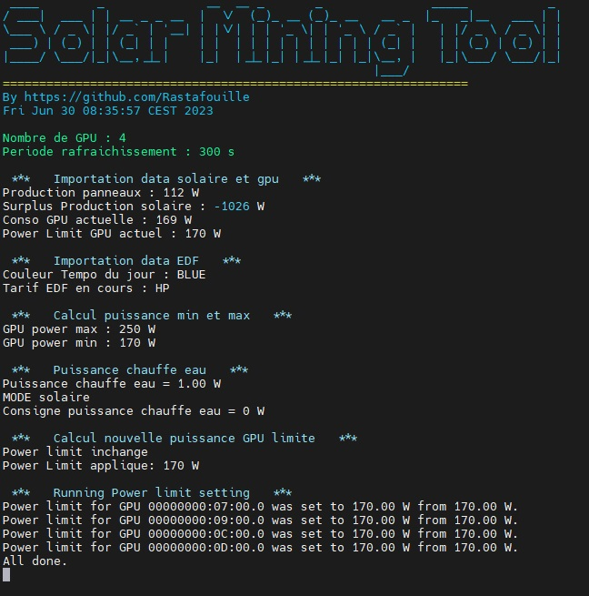

# SolarMiningTool
Pilotage de la puissance de minage en fonction de la production solaire et couleur Tempo EDF du jour

Version chauffe eau (CE), si encore surplus de puissance, on l'envoie sur le CE via grace au boitier : <https://github.com/Rastafouille/PilotageChauffeEau> 

L'idée est de réguler la puissanse électrique pour gérer le surplus solaire en restant dans des bornes min et max de puissance.
Par exemple pour ma part, en jour bleue et blanc je mine à 170W par carte et autorise à monter à 250W si surplus de production solaire. 
Par contre, en jour rouge, plutôt de 100W à 250W, voire même éteindre le worker (implémentation en cours) ou carrément éteindre le rig via une prise connectée 
(si je me chauffe je regarde...) 

Version chauffe eau (CE), idem pour la puissance du rig, une fois qu'il est au max on envoie le reste au CE, et inversement qd la puissance solaire diminue, on diminue celle du CE puis du Rig.

## Préalables

Passer le script en executable

	$ chmod +x SolarMiningTool.sh
	
### Librairies  à installer :
	$ sudo apt-get update -y 
	$ sudo apt-get install -y figlet 
	$ sudo apt-get install -y jq 
	$ sudo apt install screen

### API Tempo
Pour récupérer la couleur Tempo via RTE
- Créer un compte su <https://data.rte-france.com/>
- Créer une application "web/serveur" associée à l'API "Tempo Like Supply Contract"
- Recupérer son identifiant en cliquant sur "copier en base 64"

### API onduleur
Pour récupérer les valeurs de production solaire et surtout de surplus. Pour ma part j'ai un onduleur Solax Power
- Se connecter à son compte <https://www.solaxcloud.com/#/login>
- Dans Service/API récuperer son token ID et API address
- Dans Device/Inverter récupérer le Registration No. de son onduleur 

### Réglage des paramètres

Modifier le fichier .json en remplacant les "xxx" par vos valeurs et renommer en ApiData.json
- base64="<votre identifiant api tempo en base 64>"
- solax_tokenid="<tokenid de l'APi Solax>"
- solax_sn="<Registration No. de son onduleur Solax>"

Dans l'entête du script SolarMiningTool.sh éditer tous vos paramètres :
- gpu_nombre=<nombre de gpu sur le rig>
- refresh_time_second=<période de rachraichissement des puissances>

Puis toutes les puissances que vous souhaitez en fonction de la couleur tempo et le tarif HC ou HP

Sachant que le soleil en HC ...

### Lancement au démarrage

Pour que le script se lance dans un screen au démarrage

Sur ubuntu :

	$ sudo nano /etc/rc.local
	Ajouter
	$ screen -S SolarMiningTool /home/user/SolarMiningTool/SolarMiningTool.sh && screen -d SolarMiningTool
 
Pour hive os

	$ sudo nano /home/user/xinit.user.sh
	Ajouter
	$ screen -S SolarMiningTool /home/user/SolarMiningTool/SolarMiningTool.sh && screen -d SolarMiningTool

### Alias

J'aime bien rajouter des raccourci pour aller voir le screen et le fichier de log.
dans le .bashrc rajouter :

	$ alias solard='screen -d SolarMiningTool'
	$ alias solar='screen -r SolarMiningTool'
	$ alias solarlog='nano SolarMiningTool/solar_mining_log.txt'
